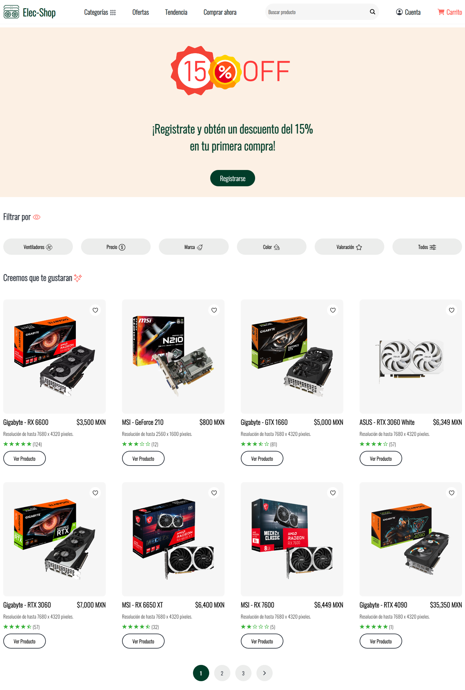
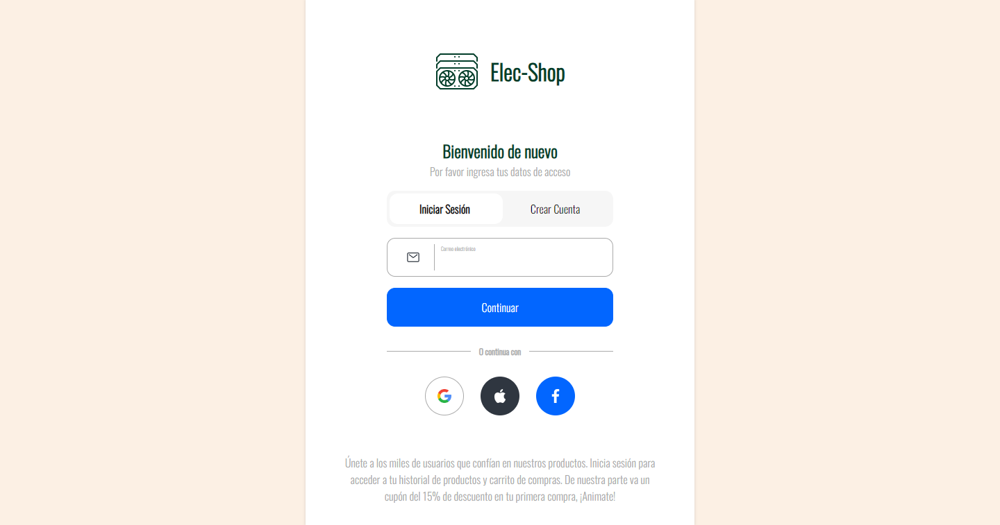
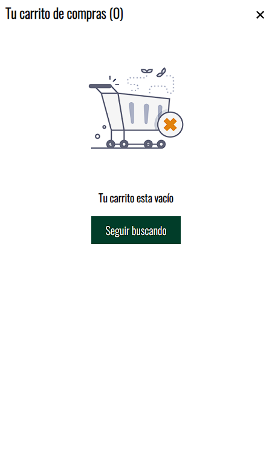
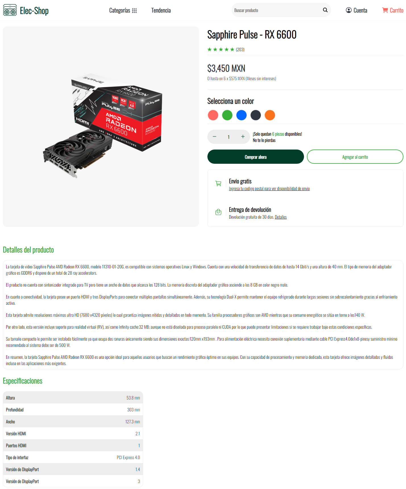
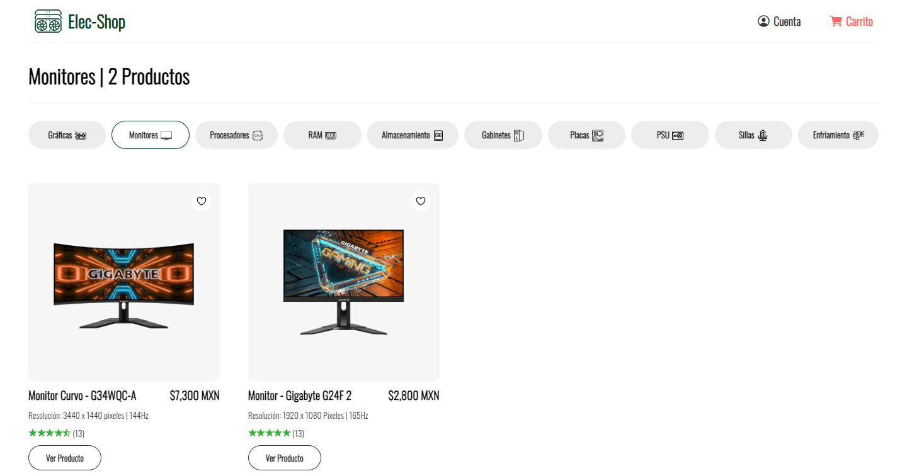
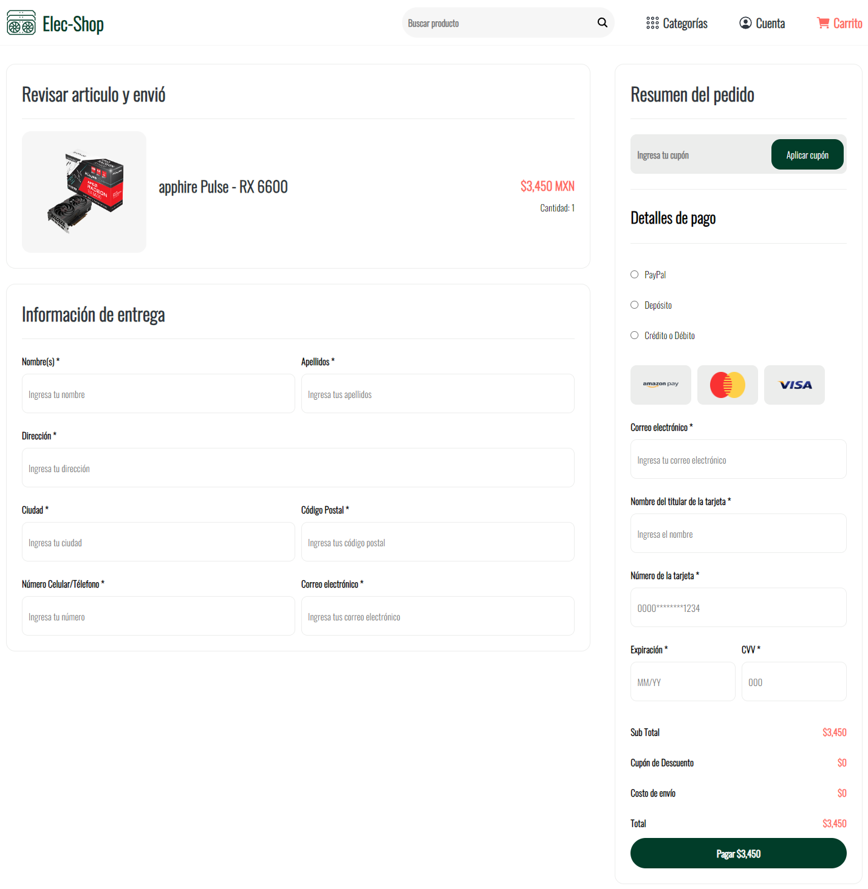
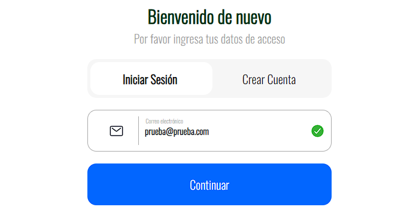
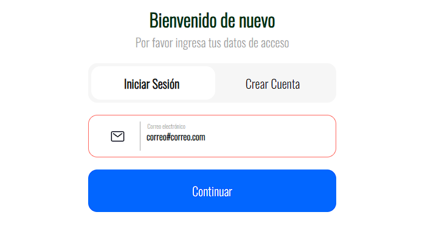

# Elec-Shop | Ecommerce         

### 📝 Descripción breve
  Sitio web de tipo Ecommerce el cual prioriza la experiencia usuario, facilitando a los clientes encontrar y comprar los productos que necesitan. 
Pestañas/Secciones Web principales:  

❓ Estático = No cambia su contenido.  
❓ Dinámico = Su contenido cambia por cada producto.  
❓ Funcionalidad = Solo se muestra cuando el usuario reliza una determinada acción en los inputs.

* 🔐 Inicio de Sesión (Estático),
* 🛒 Carrito de compras (Dinámico),
* 👀 Visualizar Producto (Dinámico),
* 📋 Productos por categoría (Dinámico),
* 💸 Comprar productos (Dinámico),
* ✅ Validación de campos (Funcionalidad),
* 🗨️ Sistema de Alertas (Estático),

##

### Sección | 🔐 Inicio de Sesión
La siguiente imagen muestra la interfaz de <b>INICIAR SESION.</b>
   

##

### Sección | 🛒 Carrito de compras 
La siguiente imagen muestra la interfaz del <b>CARRITO DE COMPRAS CON PRODUCTOS.</b> 
   

   
La siguiente imagen muestra la interfaz del <b>CARRITO DE COMPRAS VACIO.</b> 
   

##

### Sección | 👀 Visualizar Producto
La siguiente imagen muestra la interfaz de <b>VISUALIZAR PRODUCTO.</b>
   

##

### Sección | 📋 Productos por Categoría
La siguiente imagen muestra la interfaz de <b>PRODUCTOS POR CATEGORIA.</b>
   

##

### Sección | 💸 Comprar Productos
La siguiente imagen muestra la interfaz de <b>COMPRAR PRODUCTOS.</b>
   

##

### Sección | ✅ Validación de campos
La siguiente imagen muestra la interfaz de <b>VALIDACION CORRECTA.</b>
   

   
La siguiente imagen muestra la interfaz de <b>VALIDACION INCORRECTA.</b>
   

##

### Sección | 🗨️ Sistema de Alertas (Hay más, pero solo se pondrá una de ejemplo)
La siguiente imagen muestra la interfaz de <b>ALERTA.</b>
   

